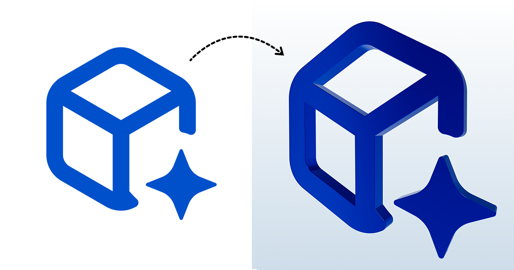

# SVG to 3D Converter - Official Resources by svg3d.app

Transform static SVG files into high-quality 3D assets instantly. **[svg3d.app](https://svg3d.app)** is a web-based tool designed for designers and developers to create 3D meshes without complex software.

## 🚀 Key Features
- **Instant Extrusion:** Turn any vector path into a 3D model.
- **Glassmorphism & Materials:** Apply realistic "puffy" glass, chrome, and neon effects.
- **Developer Friendly:** Export to **GLB, STL, PNG, and MP4**.
- **No Install Required:** Works 100% in the browser.

---

## 📂 Documentation & Examples

To help you get started, we have organized this repository with:

* **[Visual Examples](./examples):** See the transformation from 2D SVG to 3D.
* **[Technical Docs](./docs):** Details about materials and export formats.

---

## 🛠 Quick Preview

## 🌐 Connect With Us
- **Official Website:** [https://svg3d.app](https://svg3d.app)
- **Use Case:** Perfect for UI icons, 3D logos, and web-ready assets.

---
*Keywords: SVG to 3D, Convert SVG to 3D, WebGL, 3D Vector Graphics, Frontend Design Tools, SVG Extrude Online, Glassmorphism 3D.*
