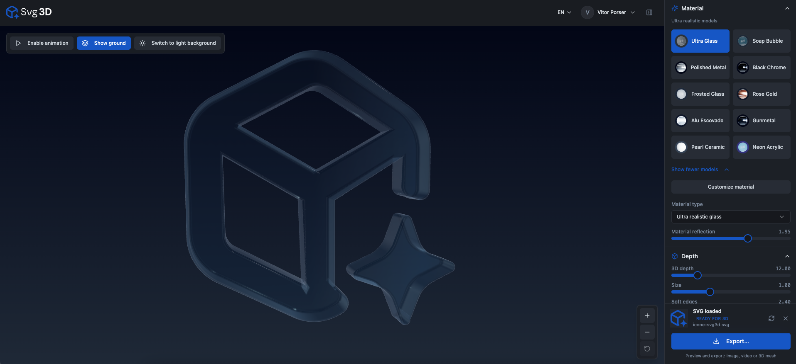
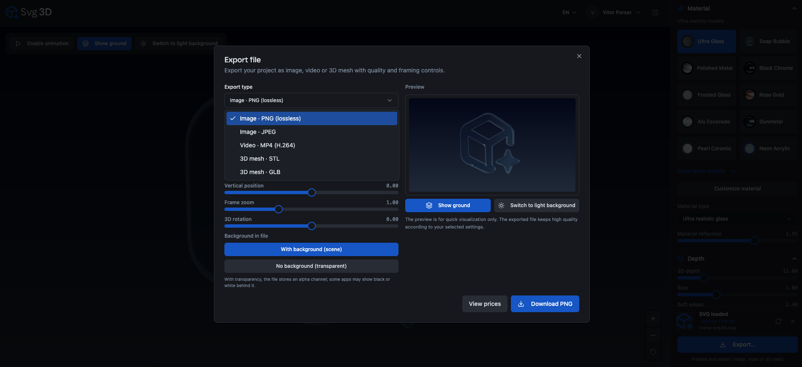

# Technical Documentation & Features

This section provides a detailed overview of the rendering and export capabilities of **[svg3d.app](https://svg3d.app)**.

## 🎨 Advanced Material Shaders
The application uses a custom WebGL engine to render high-fidelity materials in real-time. This allows users to preview professional finishes before exporting.

### Available Presets:
* **Ultra Glass:** A realistic glassmorphism effect with refraction and transparency.
* **Polished Metal & Chrome:** High-reflectivity surfaces for a premium tech feel.
* **Neon Acrylic:** Self-illuminated materials perfect for dark-themed UI designs.
* **Soap Bubble:** An iridescent, multi-color effect for creative visuals.

---

## 📦 Export Formats & Compatibility
svg3d.app is built to fit into any professional workflow, from web development to 3D printing.

| Format | Category | Use Case |
| :--- | :--- | :--- |
| **PNG (Lossless)** | Image | Transparent 3D icons for websites and mobile apps. |
| **MP4 (H.264)** | Video | Animated 3D logos for social media and presentations. |
| **GLB** | 3D Mesh | Industry-standard for WebGL (Three.js), AR/VR, and game engines. |
| **STL** | 3D Mesh | Standard format for 3D printing and CAD software. |

---

## 🛠 Advanced Controls
Users can fine-tune their models using the following parameters:
* **3D Depth:** Control the thickness of the extrusion.
* **Soft Edges (Bevel):** Adjust the roundness of the corners for realistic lighting.
* **Material Reflection:** Increase or decrease environment mapping intensity.

---
[Return to Main Page](../README.md) | [Start Creating at svg3d.app](https://svg3d.app)
